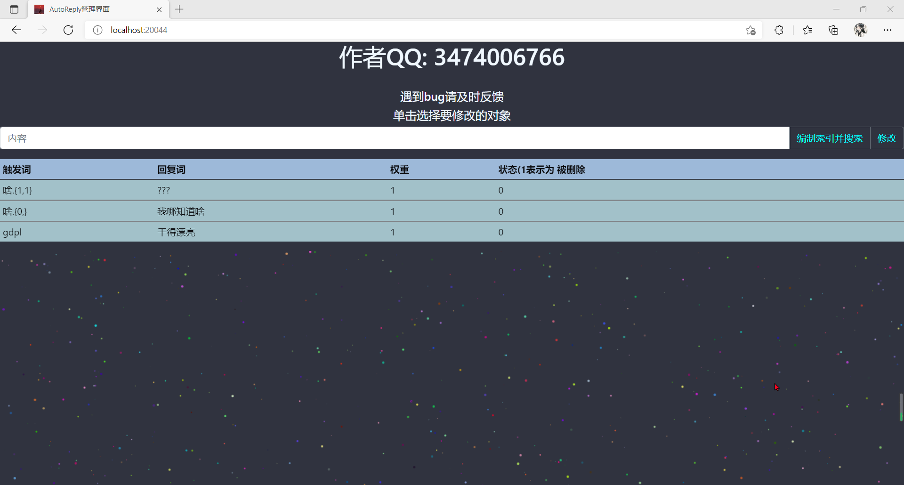

# Mirai_Plugins_Auto_Reply V 0.3

## [不兼容旧的数据](https://github.com/Kloping/Mirai_Plugins_Auto_Reply/blob/master/old_README.md)

**自动回复插件**

第一次启动后 在./conf/auto_reply下配置文件:

一般不需要手动配置

<details> 
<summary>示例配置 conf.json </summary> 

```json

{
  //cd 单位秒
  "cd": 0.0,
  "dataPath": "D:\\Projects\\OwnProjects\\MiraiPAutoRe\\conf\\auto_reply\\data.json",
  "deleteKey": "删除词",
  //-1 代表所有
  "deletes": [
    -1
  ],
  //-1 代表所有
  "followers": [
    -1
  ],
  "host": -1,
  "insertKey": "开始添加",
  "oneComInsert": "/添加",
  "oneComSplit": " ",
  //页面启动端口
  "port": 20044,
  "privateK": false,
  "root": "D:\\Projects\\OwnProjects\\MiraiPAutoRe",
  "selectKey": "查询词"
}

```

</details>

_**data.json :数据文件**_

_**illegalKeys: 不允许添加的词 (敏感词汇) 以空格分割**_

支持模糊词:

    %   代表单个未知字符

    %+  代表一到多个未知字符
    
    %?  代表0到多个未知字符
    
    正则表达式同时生效

指令

    /autoReply setHost <q>    # 设置主人
    /autoReply addF <q>    # 添加follower
    /autoReply addD <q>    # 添加deleter
    /autoReply reload    # 重新加载配置

第一次启动应看到此字样 <br>
  <br>
点击网址可访问管理页面

目前仅可 搜索 与 修改 示例:

    #权重: 权重越大触发概率也就越大 [算法](https://github.com/Kloping/Mirai_Plugins_Auto_Reply/blob/master/src/main/java/com/hrs/kloping/MyUtils.java#L49)

当存在大量数据时 可能会出现未知异常